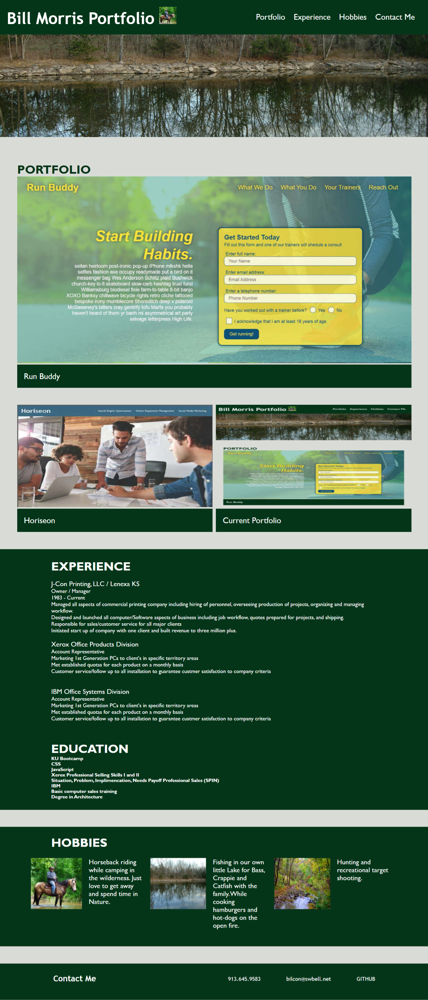

# morris-portfolio

# OBJECTIVE:
* The purpose was to create a Portfolio Website to promote the capabities and strenghts to encourage a hiring decision for full-time or part-time as well as freelance work.

# Built With
* HTML
* CSS

# Portfolio Design
* Created design with a header titled appropriately with photo and navigation links utilizing flex box.
* Utilized variables for colors and fonts to facilitate the ability to make changes easily.
* Layout was made to maximine the ability to work with media queries to fit various screen sizes.
* Portfolio layout has work with the most recent site first and then in order of completion thereafter.
* Every design has a link to open their site in an new window for utilization and uses the title attribute to let visitor know where the link will take them.
* Experiences are listed to give viewer an idea of the employment history and responsibilities.
* Education is listed to give reference to accomplishments.
* A few hobbies are listed to show personal interest outside of work.
* A contact area is given with links to phone number, email and GITHUB accounts.

## Webite
https://bilcon.github.io/morris-portfolio/

https://github.com/bilcon/morris-portfolio
# Here is a screen shot of the webpage when deployed

